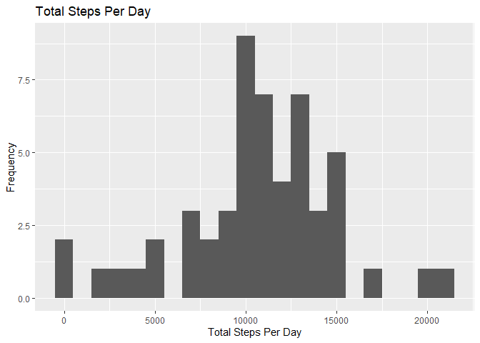
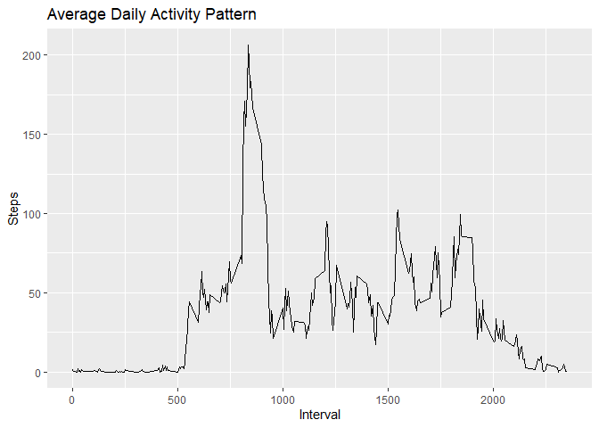
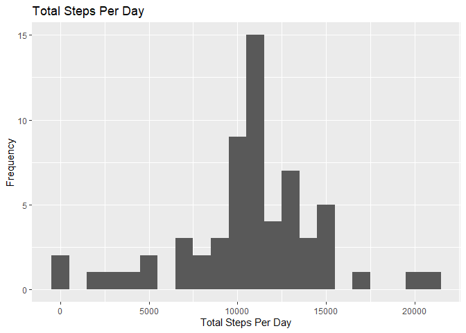
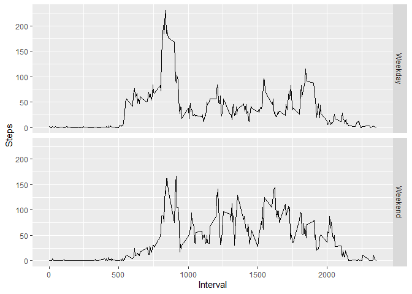

### Loading and preprocessing the data

1.  Load the data (i.e. read.csv())

2.  Process/transform the data (if necessary) into a format suitable for
    your analysis

<!-- -->

    library(knitr)
    library(ggplot2)
    temp <- tempfile()
    download.file("https://d396qusza40orc.cloudfront.net/repdata%2Fdata%2Factivity.zip",temp)
    unzip(temp, overwrite=TRUE)
    activityData <- read.csv("activity.csv")
    activtiyData <- as.Date(activityData$date, format="%Y-%m-%d")
    unlink(temp)

### What is the mean total number of steps taken per day

The following code performs the following:

    # 1. Calculate the total number of steps taken per day
    activityDataTotals <- aggregate(steps ~ date, data = activityData, sum)
    head(activityDataTotals)

    ##         date steps
    ## 1 2012-10-02   126
    ## 2 2012-10-03 11352
    ## 3 2012-10-04 12116
    ## 4 2012-10-05 13294
    ## 5 2012-10-06 15420
    ## 6 2012-10-07 11015

    # 2. If you do not understand the difference between a histogram and a barplot, research the difference between them. Make a histogram of the total number of steps taken each day

    qplot(steps, data = activityDataTotals, geom = "histogram", xlab = "Total Steps Per Day", ylab="Frequency", main="Total Steps Per Day", binwidth=1000)

    # 3. Calculate and report the mean and median of the total number of steps taken per day

    mean_steps <- mean(activityDataTotals$steps)
    mean_steps

    ## [1] 10766.19

    median_steps <- median(activityDataTotals$steps)
    median_steps

    ## [1] 10765

### What is the average daily activity pattern?

The following code performs the following:

    # 1. Make a time series plot of the 5-minute interval (x-axis) and the average number of steps taken, averaged across all days (y-axis)

    activityDataMean_interval <- aggregate(steps ~ interval, data = activityData, mean, na.rm=TRUE)
    head(activityDataMean_interval)

    ##   interval     steps
    ## 1        0 1.7169811
    ## 2        5 0.3396226
    ## 3       10 0.1320755
    ## 4       15 0.1509434
    ## 5       20 0.0754717
    ## 6       25 2.0943396

    qplot(interval, steps, data = activityDataMean_interval, geom = c("line"), xlab = "Interval", ylab="Steps", main="Average Daily Activity Pattern")

    # 2. Which 5-minute interval, on average across all the days in the dataset, contains the maximum number of steps?

    max_interval <- activityDataMean_interval[which.max(activityDataMean_interval$steps),]
    max_interval

    ##     interval    steps
    ## 104      835 206.1698

### Imputing missing values

The following code performs the following:

    # 1. Calculate and report the total number of missing values in the dataset (i.e. the total number of rows)

    na_total <- sum(is.na(activityData$steps))
    na_total

    ## [1] 2304

    # 2. Devise a strategy for filling in all of the missing values in the dataset. The strategy does not need to be sophisticated. For example, you could use the mean/median for that day, or the mean for that 5-minute interval, etc.

    # We'll replace the NA values with the average value of the interval over a period of time

    # 3. Create a new dataset that is equal to the original dataset but with the missing data filled in.

    activityData_2 <- activityData  
    na_indexes <- which(is.na(activityData_2$steps))
    for (i in na_indexes) {
      activityData_2$steps[i] <- with(activityDataMean_interval, steps[interval == activityData_2$interval[i]])
    }

    # Print few first rows of the new dataset

    head(activityData_2)

    ##       steps       date interval
    ## 1 1.7169811 2012-10-01        0
    ## 2 0.3396226 2012-10-01        5
    ## 3 0.1320755 2012-10-01       10
    ## 4 0.1509434 2012-10-01       15
    ## 5 0.0754717 2012-10-01       20
    ## 6 2.0943396 2012-10-01       25

    # Verify new data set does not contain any NA values

    na_total_new <- sum(is.na(activityData_2$steps))
    na_total_new

    ## [1] 0

    # 4, Make a histogram of the total number of steps taken each day and Calculate and report the mean and median total number of steps taken per day. Do these values differ from the estimates from the first part of the assignment? What is the impact of imputing missing data on the estimates of the total daily number of steps?

    activityData_2Totals <- aggregate(steps ~ date, data = activityData_2, sum)
    head(activityData_2Totals)

    ##         date    steps
    ## 1 2012-10-01 10766.19
    ## 2 2012-10-02   126.00
    ## 3 2012-10-03 11352.00
    ## 4 2012-10-04 12116.00
    ## 5 2012-10-05 13294.00
    ## 6 2012-10-06 15420.00

    qplot(steps, data = activityData_2Totals, geom = "histogram", xlab = "Total Steps Per Day", ylab="Frequency", main="Total Steps Per Day", binwidth=1000)

    # The new mean and median after replacement of the NAs.

    mean_new_steps <- mean(activityData_2Totals$steps)
    mean_new_steps

    ## [1] 10766.19

    median_new_steps <- median(activityData_2Totals$steps)
    median_new_steps

    ## [1] 10766.19

The new mean and median become the same after replacement of the NAs.

### Are there differences in activity patterns between weekdays and weekends?

    # 1. Create a new factor variable in the dataset with two levels – “weekday” and “weekend” indicating whether a given date is a weekday or weekend day.

    activityData_2$day <- c("Weekday")

    activityData_2[weekdays(as.Date(activityData_2[, 2])) %in% c("Saturday", "Sunday","saturday", "sunday"), ][4] <- c("Weekend")

    # 2. Make a panel plot containing a time series plot of the 5-minute interval (x-axis) and the average number of steps taken, averaged across all weekday days or weekend days (y-axis). See the README file in the GitHub repository to see an example of what this plot should look like using simulated data.

    activityDay_totals <- aggregate(steps ~ interval+day, data = activityData_2, mean)

    qplot(interval, steps, data = activityDay_totals, facets = day ~ ., geom = c("line"), xlab = "Interval", ylab="Steps")

Activity on Weekdays has the highest peak in one interval over others.
On weekends the activity have more peaks. The weekend activity rate is
much higher throughout the day compared to the weekdays.
